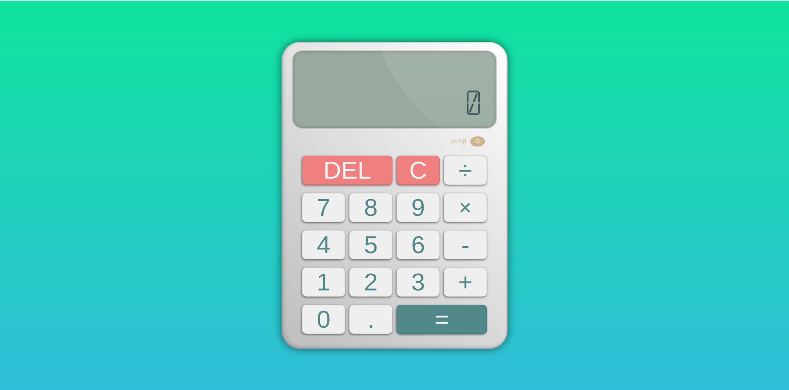

# CALCULATOR PROJECT

This is the last project from the TOP beginner course.
We were asked to build a very basic calculator to demonstrate
our DOM manipulation skills and our overall knowledge with what
we have learned so far.

As always, I took a step further and added a few more teaks like scientific notation, on/off button...

> SOURCES
- [Link to TOP lesson](https://www.theodinproject.com/lessons/foundations-calculator)